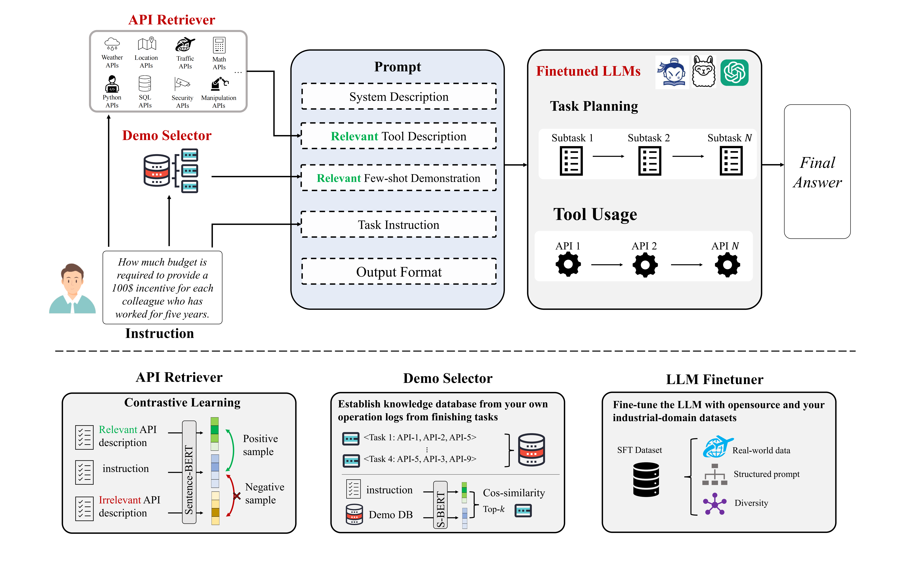

# The core code of "Boosting Task Planning and Tool Usage of Large Language Model-based Agents in Real-world Industry Systems"

## Overview


## RUN
```bash
python scripts/valuation_planning_dev_ssw_API_retriever.py
```
